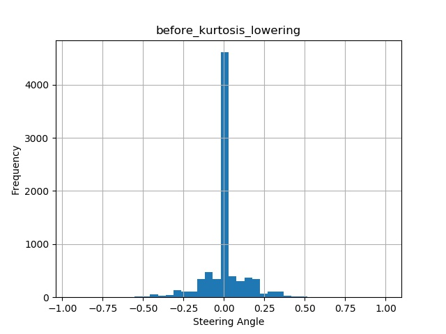
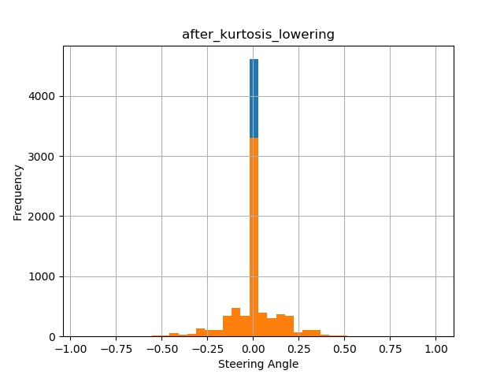
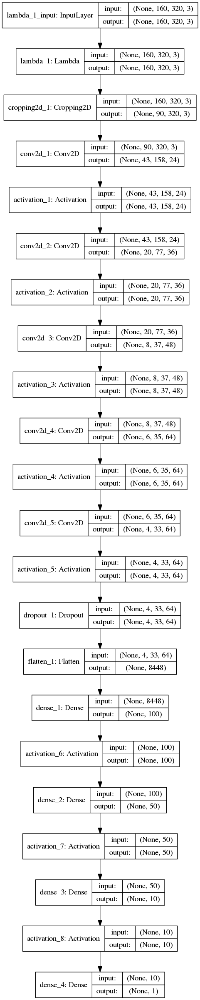

# **Behavioral Cloning** 

**Behavioral Cloning Project**

The goals / steps of this project are the following:
* Use the simulator to collect data of good driving behavior.
* Build, a convolution neural network in Keras that predicts steering angles from images.
* Train and validate the model with a training and validation set.
* Test that the model successfully drives around track one without leaving the road.

## Result

For the full result click the image below to see a video of the vehicle driving around a track:

[](http://www.youtube.com/watch?v=ade3Rtv3afc)


## Theory of Operation

For this task I tried multiple different network architectures to achieve the best result. I found the best result to 
be an adapted implementation of NVIDAS DAVE-2 architecture outlined in the paper found here: 

https://images.nvidia.com/content/tegra/automotive/images/2016/solutions/pdf/end-to-end-dl-using-px.pdf

### Data Collection and Augmentation

For the data collection with this task I initially tried to gather the data myself. I tried multiple different 
techniques including mainly center lane driving, including some variations in drift, driving the track in reverse and 
driving other tracks.

The issues I encountered when doing this was lack of a joystick therefore meaning I had to use the arrow keys to steer 
the vehicle. The issue with this was that I was getting a high distribution of steering angles at the extreme edges of
my distribution due to the fact that using the arrow keys is a binary input. When training my network with this data I 
was finding that ego's pose was heavily bias towards the edges of a lane and the steering angle was very jerky. Whilst
I tried augmenting the dataset to account for this I found it very difficult to get a good training set due to bad input 
data to start with. 

I next changed to use udacitys sample training data which was much more of a normal distribution to begin with:



When looking at this dataset I noticed a few things, firstly the dataset had a leptokurtic (high peak) kurtosis. This 
was due to the fact that there were a larger amount of strait lines in the dataset than curves. To account for this
I introduced the method `lower_kurtosis()` in the `PreProcessData` class. This scaled down the amount of zero steering 
angle images my a percentage, in the end I found the optimum scale down factor was by 30% due to the fact we still want 
a large ammount of strait lines as this is going to be more common than curves however we do not want it to dominate the 
dataset:



What I also noticed from the data was that it was heavily bias to the left as there were more left hand curves in the 
training set. To account for this when I produced my training and validation set, I doubled the ammount of data by 
flipping the images and multiplying the steering value by `-1.` to invert the steering angle. This increased the dataset
and created a distribution that was closer to a gaussian.

The final step was to implement a generator, the reason for this was that my dataset was large, as were the images, 
meaning that it was a struggle to store these in memory. This generator can be found in the `PreProcessData` class under
the method `run_generator()`. Here we take in a batch size and use this to produce our generated X and y dataset.

### Model

As stated before my model is based upon the DAVE-2 model by NVIDIA. A graphical outline of my network can be seen below:

  

In my network I perform the following steps:

1) First I have a Lambda layer, this is used to normalise the input training data on the fly by disiving the colour 
channels by 255 and subtracting 0.5.
2) I then crop my images to the region of interest, removing excess background and foreground so we are only focusing 
on the lane. This is done on the fly to reduce the memory requirements of the system.
3) I now have a set of 3 convolutions with a kernel size of 5 and a stride of 2. Each convolution layer is followed by 
a RELU activation layer.
4) These are then followed by another two convolutions with a kernel size of 3 and a stride of 1. Again these are 
followed by relu activations.
5) At this point I introduced a dropout layer with a keep rate of 0.8, this is to help prevent any overfitting.
6) There is then a flat layer followed by 3 fully connected layers, resulting in a singular output. The reason for a 
singular output is that this is a regression network rather than a classification network.
7) In my final step I specify my optimiser and loss function when compiling the model. For this my loss function is 
going to be the mean squared error as this is regression network and for my optimiser I chose the Adam optimiser.

We can now run our training, in this training we are interested in having the mean squared error as low as possible as 
this means that are points are as close to the regression line as possible.

My final hyper parameters were:

| Param        | Value |
|--------------|-------|
| Epochs       | 5     |
| Batch Size   | 32    |
| Dropout Loss | 0.2   |

## Usage

Requirements:

- Python Version >= 3.7

Install dependencies:
```bash
pip install -r requirements.txt
```

Unzip Training Data (If pigz is installed this is fastest else gzip or gunzip will do):
```bash
pigz -rd ./training_data
```

Export Package to PYTHONPATH (if needed):
```bash
export
PYTHONPATH=$PYTHONPATH:/path/to/repo/Behavioural-Cloning_CNN/src/
```

To train network:
```bash
python src/behavioural_cloning_cnn/run_training.py
```

Options and Flags:
```bash
usage: run_training.py [-h] [--csv CSV] [--epochs EPOCHS]
                       [--batch_size BATCH_SIZE] [--keep_prob KEEP_PROB]
                       [--print_architecture] [--save_model_image]

Run NN Training For Behavioural Cloning

optional arguments:
  -h, --help            show this help message and exit
  --csv CSV             String path to CSV
  --epochs EPOCHS       Integer number of epochs to train
  --batch_size BATCH_SIZE
                        Size of batches to be processed
  --keep_prob KEEP_PROB
                        The percentage of dropout in the network
  --print_architecture  Print Model Architecture to STDOUT
  --save_model_image    Same an image of the Model to disk

```